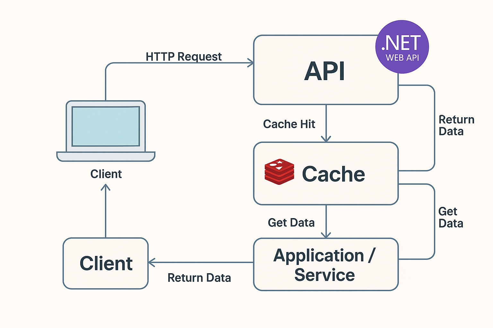

# RestaurantesAPI
## Using Redis as Cache (Usando Redis como Cache)
<table style="border: none; border-collapse: collapse;">
  <tr>
    <td style="border: none; padding: 10px;">
<p>In contemporary APIs, two mandatory factors are performance and scalability. The exponential and volumetric growth of data, along with the need for real-time response in web applications, makes the       use of caching techniques essential to reduce database overload, thereby improving the user experience.</p>
  <p>In what follows, we will design a REST API using ASP.NET Core and Entity Framework Core to retrieve a list of restaurants, incorporating Redis as a caching mechanism. This ensures faster responses and better performance when accessing data.</p>
<p>You will learn in practice how to build a clean and reusable project that optimizes database queries, configures Redis in ASP.NET, implements cache logic transparently to the user, and fine-tunes your queries to improve performance. This article is aimed at .NET developers who want to adopt new approaches to enhance performance in Web APIs.</p>

</td>
    <td style="border: none; padding: 10px;">
      <p>Em APIs contemporâneas, dois fatores obrigatórios são o desempenho e escalabilidade. O crescimento exponencial e volumétrico de dados, assim como a necessidade de resposta em tempo real em aplicações web tornam essenciais o uso de técnicas de cache para sobrecargas de banco de dados, melhorando a experiência do usuário.</p>      
<p>No que se segue, desenharemos uma API REST com o ASP.NET Core e Entity Framework Core para restaurar uma lista de restaurantes, incorporando o Redis como um mecanismo de cache. Isso assegura respostas mais rápidas e melhor performance ao acessarem os dados.</p>

<p>Você vai na prática aprender a montar um projeto limpo e reutilizável que otimize as consultas ao banco de dados, configure o Redis no ASP.NET, implemente lógica de cache transparente ao usuário e otimize suas consultas ao banco de dados para aprimorar a performance. Este artigo é voltado para programadores em .NET que queiram incorporar novas abordagens ao rendimento em APIs Web Action</p>
</td>
  </tr>
</table>



## Technologies Used - Tecnologias Empregadas

<table style="border: none; border-collapse: collapse;">
  <tr>
    <td style="border: none; padding: 10px;">
<p>This project was developed using the .NET ecosystem with a focus on best practices in architecture, performance, and scalability. Below, we list the main technologies used:</p>

- **ASP.NET Core 8 (Web API):** Modern and cross-platform framework from Microsoft for building RESTful APIs. We used features from version 8.0 to create HTTP endpoints in a clean and efficient way.
- **Entity Framework Core 8:** Microsoft's official ORM (Object-Relational Mapper) for data access. Used to map domain entities and manage data persistence in the relational database in a fluent and object-oriented way.
- **Pomelo.EntityFrameworkCore.MySql:** Entity Framework Core provider for MySQL databases. It allows us to use EF Core features with a MySQL or MariaDB database natively.
- **Redis:** In-memory database, widely used as a distributed caching system. In this project, Redis is responsible for temporarily storing the most frequent queries, reducing the number of database accesses and significantly improving the API response time.
- **StackExchange.Redis:** Client library for communication with Redis in .NET. Used to implement read and write operations on the cache in a performant and secure manner.
-	**Clean Architecture:** The project structure follows the principles of Clean Architecture, promoting the separation of responsibilities across layers (Domain, Application, Infrastructure, and API), making the application easier to maintain, scale, and test.

<p>This set of technologies provides a solid foundation for developing modern, high-performance APIs that are easy to evolve, catering to both web and mobile applications.</p>

      
  </td>
  <td style="border: none; padding: 10px;">
    <p>Este projeto foi desenvolvido utilizando o ecossistema .NET com foco em boas práticas de arquitetura, performance e escalabilidade. Abaixo, listamos as principais tecnologias utilizadas:</p>

- **ASP.NET Core 8 (Web API):** Framework moderno e multiplataforma da Microsoft para construção de APIs RESTful. Utilizamos os recursos da versão 8.0 para criação dos endpoints HTTP de forma limpa e eficiente.
- **Entity Framework Core 8:** ORM (Object-Relational Mapper) oficial da Microsoft para acesso a dados. Usado para mapear as entidades de domínio e gerenciar a persistência de dados no banco de dados relacional de forma fluida e orientada a objetos.
- **Pomelo.EntityFrameworkCore.MySql:** Provedor do Entity Framework Core para bancos de dados MySQL. Ele nos permite utilizar os recursos do EF Core com um banco MySQL ou MariaDB de maneira nativa.
- **Redis:** Banco de dados em memória, amplamente usado como sistema de cache distribuído. Neste projeto, o Redis é responsável por armazenar as consultas mais frequentes de forma temporária, reduzindo o número de acessos ao banco de dados e melhorando significativamente o tempo de resposta da API.
-	**StackExchange.Redis:** Biblioteca cliente para comunicação com o Redis no .NET. Utilizada para implementar as operações de leitura e escrita no cache de forma performática e segura.
-	**Clean Architecture:** A estrutura do projeto segue os princípios da Arquitetura Limpa (Clean Architecture), promovendo a separação de responsabilidades entre camadas (Domínio, Aplicação, Infraestrutura e API), facilitando a manutenção, escalabilidade e testabilidade da aplicação.

<p>Esse conjunto de tecnologias oferece uma base sólida para desenvolvimento de APIs modernas, performáticas e fáceis de evoluir, atendendo tanto aplicações web quanto mobile.</p>        
  </tr>
</table>

## Application Setup Process - Processo de Setup da aplicação

<table style="width:100%;">
  <tr style="width:50%;">
    <td>Considering we are in a Windows operating system environment and Docker Desktop is already installed and running, we can proceed with the following steps.

<h3>Installing Redis Locally with Docker Desktop - Instalando Redis localmente com Docker Desktop</h3>
Run the command below to download and start the Redis Server container in your local Docker environment.
      
```powershelll
  docker run -d --name redis-server -p 6379:6379 -v redis-data:/data redis
```

<h3>Service Testing</h3>
The command below performs a test to check if Redis is running properly.

```powershell
docker exec -it redis-server redis-cli
> SET meuTeste “Bom dia Carlos Vamberto Filho”
> GET meuTest
> exit
```

<h3>Installing MySQL Locally with Docker Desktop</h3>
We will also run MySQL in a container for use in this application. With the command below, we will run MySQL on the default port 3306.

```powershell
docker run --name mysql-local -e MYSQL_ROOT_PASSWORD=Senha123  -p 3306:3306
```

<h3>Creating the Restaurant Table</h3>
I used the MySQL Workbench application to connect to the MySQL server and create the restaurant table in a new database called “meubanco”.

```sql
-- Cria o banco de dados se ainda não existir
CREATE DATABASE IF NOT EXISTS meubanco CHARACTER SET utf8mb4 COLLATE utf8mb4_general_ci;
-- Usa o banco de dados
USE meubanco;
-- Criação da tabela restaurantes
CREATE TABLE IF NOT EXISTS restaurantes (
    Id INT AUTO_INCREMENT PRIMARY KEY,
    Nome VARCHAR(255) NOT NULL,
    Tipo VARCHAR(100),
    Endereco VARCHAR(255),
    Cidade VARCHAR(100),
    Regiao VARCHAR(100),
    Pais VARCHAR(100)
);
```

<h3>Inserts records into the Restaurants table</h3>
Here we will create records for 50 existing restaurants in the Algarve region of Portugal to demonstrate the API.
Run the script below to insert the records:

```sql
USE meubanco;

INSERT INTO restaurantes (Nome, Tipo, Endereco, Cidade, Regiao, Pais) VALUES
('Luar da Foia', 'Portuguesa tradicional', 'Estrada da Foia', 'Monchique', 'Algarve', 'Portugal'),
('Petisqueira 3 em Pipa', 'Petiscos', 'Rua do Prior 3', 'Faro', 'Algarve', 'Portugal'),
('Casa da Rocha', 'Marisqueira', 'Praia da Rocha', 'Portimao', 'Algarve', 'Portugal'),
('Sueste', 'Portuguesa tradicional', 'Rua Infante D. Henrique 55', 'Ferragudo', 'Algarve', 'Portugal'),
('Vai e Volta', 'Grelhados de peixe', 'Avenida 5 de Outubro', 'Olhao', 'Algarve', 'Portugal'),
('Matuya Sushi', 'Japonesa', 'Avenida Beira Mar', 'Armacao de Pera', 'Algarve', 'Portugal'),
('Sexy Meat', 'Churrascaria', 'Rua Almeida Garrett', 'Albufeira', 'Algarve', 'Portugal'),
('BJ''s Oceanside', 'Peixes e mariscos', 'Praia do Almargem', 'Quarteira', 'Algarve', 'Portugal'),
('Oliwander''s', 'Portuguesa contemporanea', 'Rua da Porta de Loule', 'Loule', 'Algarve', 'Portugal'),
('Taberna da Mare', 'Petiscos', 'Rua Direita 70', 'Portimao', 'Algarve', 'Portugal'),
('Tasca da Lota', 'Portuguesa tradicional', 'Avenida dos Descobrimentos', 'Lagos', 'Algarve', 'Portugal'),
('Pomò La Pasta Italiana', 'Italiana', 'Rua 25 de Abril', 'Lagos', 'Algarve', 'Portugal'),
('Go Bao', 'Asiatica', 'Rua Conselheiro Joaquim Machado', 'Lagos', 'Algarve', 'Portugal'),
('Gelicia', 'Gelataria', 'Rua Candido dos Reis', 'Lagos', 'Algarve', 'Portugal'),
('Ti Raul', 'Snacks e saudavel', 'Rua da Praia', 'Arrifana', 'Algarve', 'Portugal'),
('Restaurante do Cabrita', 'Marisqueira', 'Rua da Igreja', 'Carrapateira', 'Algarve', 'Portugal'),
('A Sereia', 'Rodizio de peixe', 'Rua Comandante Matoso', 'Sagres', 'Algarve', 'Portugal'),
('O Teodosio', 'Frango piri-piri', 'Rua 25 de Abril', 'Guia', 'Algarve', 'Portugal'),
('Casa do Polvo Tasquinha', 'Polvo e mariscos', 'Rua da Republica', 'Santa Luzia', 'Algarve', 'Portugal'),
('Polvo & Companhia', 'Polvo e mariscos', 'Rua da Liberdade', 'Santa Luzia', 'Algarve', 'Portugal'),
('Ria', 'Peixes e mariscos', 'Anantara Vilamoura', 'Vilamoura', 'Algarve', 'Portugal'),
('Café Correia', 'Marisqueira', 'Rua 1º de Maio', 'Vila do Bispo', 'Algarve', 'Portugal'),
('Bon Bon', 'Gastronomia contemporanea', 'Rua do Monte Carvoeiro', 'Carvoeiro', 'Algarve', 'Portugal'),
('Prato Cheio', 'Portuguesa tradicional', 'Rua Dr. Francisco Sa Carneiro 23A', 'Lagos', 'Algarve', 'Portugal'),
('Casa da Igreja', 'Marisqueira', 'Rua de Cacela Velha 2', 'Cacela Velha', 'Algarve', 'Portugal'),
('Vila Lisa', 'Portuguesa tradicional', 'Rua da Hortinha', 'Portimao', 'Algarve', 'Portugal'),
('O Tonel', 'Portuguesa tradicional', 'Rua Dr. Augusto da Silva Carvalho', 'Tavira', 'Algarve', 'Portugal'),
('Cha Cha Cha', 'Portuguesa contemporanea', 'Rua Vasco da Gama', 'Olhao', 'Algarve', 'Portugal'),
('O Cantinho da Cristina', 'Portuguesa tradicional', 'Rua do Comercio', 'Olhao', 'Algarve', 'Portugal'),
('Restaurante Noelia', 'Peixes e mariscos', 'Avenida Ria Formosa', 'Cabanas de Tavira', 'Algarve', 'Portugal'),
('Restaurante Azenha do Mar', 'Marisqueira', 'Estrada Nacional 120', 'Aljezur', 'Algarve', 'Portugal'),
('Restaurante O Camilo', 'Peixes e mariscos', 'Praia do Camilo', 'Lagos', 'Algarve', 'Portugal'),
('Restaurante O Marinheiro', 'Mediterranea', 'Rua da Torre Velha', 'Albufeira', 'Algarve', 'Portugal'),
('Restaurante O Pescador', 'Peixes e mariscos', 'Rua 5 de Outubro', 'Quarteira', 'Algarve', 'Portugal'),
('Restaurante A Forja', 'Portuguesa tradicional', 'Rua da Barca', 'Portimao', 'Algarve', 'Portugal'),
('Restaurante O Alambique', 'Portuguesa tradicional', 'Estrada Nacional 125', 'Almancil', 'Algarve', 'Portugal'),
('Restaurante O Cais', 'Peixes e mariscos', 'Avenida dos Descobrimentos', 'Vilamoura', 'Algarve', 'Portugal'),
('Restaurante O Galeão', 'Portuguesa tradicional', 'Rua da Praia', 'Armação de Pêra', 'Algarve', 'Portugal'),
('Restaurante A Tasca', 'Petiscos', 'Rua do Comércio', 'Loulé', 'Algarve', 'Portugal'),
('Restaurante O Farol', 'Peixes e mariscos', 'Praia do Farol', 'Ilha do Farol', 'Algarve', 'Portugal'),
('Restaurante O Pátio', 'Portuguesa tradicional', 'Rua das Flores', 'Tavira', 'Algarve', 'Portugal'),
('Restaurante O Barril', 'Peixes e mariscos', 'Praia do Barril', 'Tavira', 'Algarve', 'Portugal'),
('Restaurante O Zé', 'Portuguesa tradicional', 'Rua da Alegria', 'Faro', 'Algarve', 'Portugal'),
('Restaurante O Pescador', 'Peixes e mariscos', 'Rua da Praia', 'Quarteira', 'Algarve', 'Portugal'),
('Restaurante A Marisqueira', 'Marisqueira', 'Avenida Marginal', 'Lagos', 'Algarve', 'Portugal'),
('Restaurante O Grelhador', 'Grelhados', 'Rua do Sol', 'Portimão', 'Algarve', 'Portugal'),
('Restaurante O Forno', 'Portuguesa tradicional', 'Rua do Forno', 'Silves', 'Algarve', 'Portugal'),
('Restaurante A Taberna', 'Petiscos', 'Rua da Taberna', 'Albufeira', 'Algarve', 'Portugal'),
('Restaurante O Barco', 'Peixes e mariscos', 'Avenida do Mar', 'Olhão', 'Algarve', 'Portugal'),
('Restaurante O Pátio das Laranjeiras', 'Portuguesa tradicional', 'Rua das Laranjeiras', 'Loulé', 'Algarve', 'Portugal');

```


  </td >
  <td style="width:50%;">Considerando que estamos em um ambiente com sistema operacional Windows e que o Docker Desktop já está instalado e em execução, podemos seguir com os passos a seguir.

<h3>Instalando Redis localmente com Docker Desktop</h3>
Execute o comando abaixo para baixar e iniciar o contêiner do Redis Server no seu ambiente Docker local.
      
```powershelll
  docker run -d --name redis-server -p 6379:6379 -v redis-data:/data redis
```

<h3>Testar o Serviço</h3>
O camando abixo faz um teste para ver se o Redis está em funcionamento.

```powershell
docker exec -it redis-server redis-cli
> SET meuTeste “Bom dia Carlos Vamberto Filho”
> GET meuTest
> exit
```

<h3>Installing MySQL Locally with Docker Desktop</h3>
Vamos também rodar em um container o MySQL que usaremos nesta aplicação. Com o comando abaixo vamos rodar o MySQL na porta padrão 3306.

```powershell
docker run --name mysql-local -e MYSQL_ROOT_PASSWORD=Senha123  -p 3306:3306
```

<h3>Criando a tabela Restaurante</h3>
Usei a aplicação MySQL Workbench para me conectar ao servidor do MySQL e criar a tabela de restaurantes em uma nova base de dados chamada “meubanco”.

```sql
-- Cria o banco de dados se ainda não existir
CREATE DATABASE IF NOT EXISTS meubanco CHARACTER SET utf8mb4 COLLATE utf8mb4_general_ci;
-- Usa o banco de dados
USE meubanco;
-- Criação da tabela restaurantes
CREATE TABLE IF NOT EXISTS restaurantes (
    Id INT AUTO_INCREMENT PRIMARY KEY,
    Nome VARCHAR(255) NOT NULL,
    Tipo VARCHAR(100),
    Endereco VARCHAR(255),
    Cidade VARCHAR(100),
    Regiao VARCHAR(100),
    Pais VARCHAR(100)
);
```

<h3>Insere registros na tabela Restaurantes</h3>
Aqui vamos criar registros para 50 restaurantes existentes na região do Algarve em Portugal para demonstrar a API.
Execute o script abaixo para inserir os registros:

```sql
USE meubanco;

INSERT INTO restaurantes (Nome, Tipo, Endereco, Cidade, Regiao, Pais) VALUES
('Luar da Foia', 'Portuguesa tradicional', 'Estrada da Foia', 'Monchique', 'Algarve', 'Portugal'),
('Petisqueira 3 em Pipa', 'Petiscos', 'Rua do Prior 3', 'Faro', 'Algarve', 'Portugal'),
('Casa da Rocha', 'Marisqueira', 'Praia da Rocha', 'Portimao', 'Algarve', 'Portugal'),
('Sueste', 'Portuguesa tradicional', 'Rua Infante D. Henrique 55', 'Ferragudo', 'Algarve', 'Portugal'),
('Vai e Volta', 'Grelhados de peixe', 'Avenida 5 de Outubro', 'Olhao', 'Algarve', 'Portugal'),
('Matuya Sushi', 'Japonesa', 'Avenida Beira Mar', 'Armacao de Pera', 'Algarve', 'Portugal'),
('Sexy Meat', 'Churrascaria', 'Rua Almeida Garrett', 'Albufeira', 'Algarve', 'Portugal'),
('BJ''s Oceanside', 'Peixes e mariscos', 'Praia do Almargem', 'Quarteira', 'Algarve', 'Portugal'),
('Oliwander''s', 'Portuguesa contemporanea', 'Rua da Porta de Loule', 'Loule', 'Algarve', 'Portugal'),
('Taberna da Mare', 'Petiscos', 'Rua Direita 70', 'Portimao', 'Algarve', 'Portugal'),
('Tasca da Lota', 'Portuguesa tradicional', 'Avenida dos Descobrimentos', 'Lagos', 'Algarve', 'Portugal'),
('Pomò La Pasta Italiana', 'Italiana', 'Rua 25 de Abril', 'Lagos', 'Algarve', 'Portugal'),
('Go Bao', 'Asiatica', 'Rua Conselheiro Joaquim Machado', 'Lagos', 'Algarve', 'Portugal'),
('Gelicia', 'Gelataria', 'Rua Candido dos Reis', 'Lagos', 'Algarve', 'Portugal'),
('Ti Raul', 'Snacks e saudavel', 'Rua da Praia', 'Arrifana', 'Algarve', 'Portugal'),
('Restaurante do Cabrita', 'Marisqueira', 'Rua da Igreja', 'Carrapateira', 'Algarve', 'Portugal'),
('A Sereia', 'Rodizio de peixe', 'Rua Comandante Matoso', 'Sagres', 'Algarve', 'Portugal'),
('O Teodosio', 'Frango piri-piri', 'Rua 25 de Abril', 'Guia', 'Algarve', 'Portugal'),
('Casa do Polvo Tasquinha', 'Polvo e mariscos', 'Rua da Republica', 'Santa Luzia', 'Algarve', 'Portugal'),
('Polvo & Companhia', 'Polvo e mariscos', 'Rua da Liberdade', 'Santa Luzia', 'Algarve', 'Portugal'),
('Ria', 'Peixes e mariscos', 'Anantara Vilamoura', 'Vilamoura', 'Algarve', 'Portugal'),
('Café Correia', 'Marisqueira', 'Rua 1º de Maio', 'Vila do Bispo', 'Algarve', 'Portugal'),
('Bon Bon', 'Gastronomia contemporanea', 'Rua do Monte Carvoeiro', 'Carvoeiro', 'Algarve', 'Portugal'),
('Prato Cheio', 'Portuguesa tradicional', 'Rua Dr. Francisco Sa Carneiro 23A', 'Lagos', 'Algarve', 'Portugal'),
('Casa da Igreja', 'Marisqueira', 'Rua de Cacela Velha 2', 'Cacela Velha', 'Algarve', 'Portugal'),
('Vila Lisa', 'Portuguesa tradicional', 'Rua da Hortinha', 'Portimao', 'Algarve', 'Portugal'),
('O Tonel', 'Portuguesa tradicional', 'Rua Dr. Augusto da Silva Carvalho', 'Tavira', 'Algarve', 'Portugal'),
('Cha Cha Cha', 'Portuguesa contemporanea', 'Rua Vasco da Gama', 'Olhao', 'Algarve', 'Portugal'),
('O Cantinho da Cristina', 'Portuguesa tradicional', 'Rua do Comercio', 'Olhao', 'Algarve', 'Portugal'),
('Restaurante Noelia', 'Peixes e mariscos', 'Avenida Ria Formosa', 'Cabanas de Tavira', 'Algarve', 'Portugal'),
('Restaurante Azenha do Mar', 'Marisqueira', 'Estrada Nacional 120', 'Aljezur', 'Algarve', 'Portugal'),
('Restaurante O Camilo', 'Peixes e mariscos', 'Praia do Camilo', 'Lagos', 'Algarve', 'Portugal'),
('Restaurante O Marinheiro', 'Mediterranea', 'Rua da Torre Velha', 'Albufeira', 'Algarve', 'Portugal'),
('Restaurante O Pescador', 'Peixes e mariscos', 'Rua 5 de Outubro', 'Quarteira', 'Algarve', 'Portugal'),
('Restaurante A Forja', 'Portuguesa tradicional', 'Rua da Barca', 'Portimao', 'Algarve', 'Portugal'),
('Restaurante O Alambique', 'Portuguesa tradicional', 'Estrada Nacional 125', 'Almancil', 'Algarve', 'Portugal'),
('Restaurante O Cais', 'Peixes e mariscos', 'Avenida dos Descobrimentos', 'Vilamoura', 'Algarve', 'Portugal'),
('Restaurante O Galeão', 'Portuguesa tradicional', 'Rua da Praia', 'Armação de Pêra', 'Algarve', 'Portugal'),
('Restaurante A Tasca', 'Petiscos', 'Rua do Comércio', 'Loulé', 'Algarve', 'Portugal'),
('Restaurante O Farol', 'Peixes e mariscos', 'Praia do Farol', 'Ilha do Farol', 'Algarve', 'Portugal'),
('Restaurante O Pátio', 'Portuguesa tradicional', 'Rua das Flores', 'Tavira', 'Algarve', 'Portugal'),
('Restaurante O Barril', 'Peixes e mariscos', 'Praia do Barril', 'Tavira', 'Algarve', 'Portugal'),
('Restaurante O Zé', 'Portuguesa tradicional', 'Rua da Alegria', 'Faro', 'Algarve', 'Portugal'),
('Restaurante O Pescador', 'Peixes e mariscos', 'Rua da Praia', 'Quarteira', 'Algarve', 'Portugal'),
('Restaurante A Marisqueira', 'Marisqueira', 'Avenida Marginal', 'Lagos', 'Algarve', 'Portugal'),
('Restaurante O Grelhador', 'Grelhados', 'Rua do Sol', 'Portimão', 'Algarve', 'Portugal'),
('Restaurante O Forno', 'Portuguesa tradicional', 'Rua do Forno', 'Silves', 'Algarve', 'Portugal'),
('Restaurante A Taberna', 'Petiscos', 'Rua da Taberna', 'Albufeira', 'Algarve', 'Portugal'),
('Restaurante O Barco', 'Peixes e mariscos', 'Avenida do Mar', 'Olhão', 'Algarve', 'Portugal'),
('Restaurante O Pátio das Laranjeiras', 'Portuguesa tradicional', 'Rua das Laranjeiras', 'Loulé', 'Algarve', 'Portugal');
```
   </td>
  </tr>
</table>
